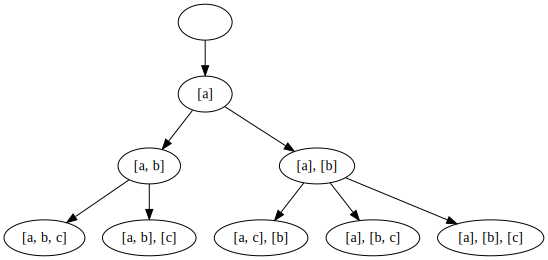
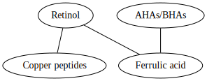
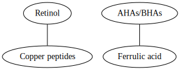
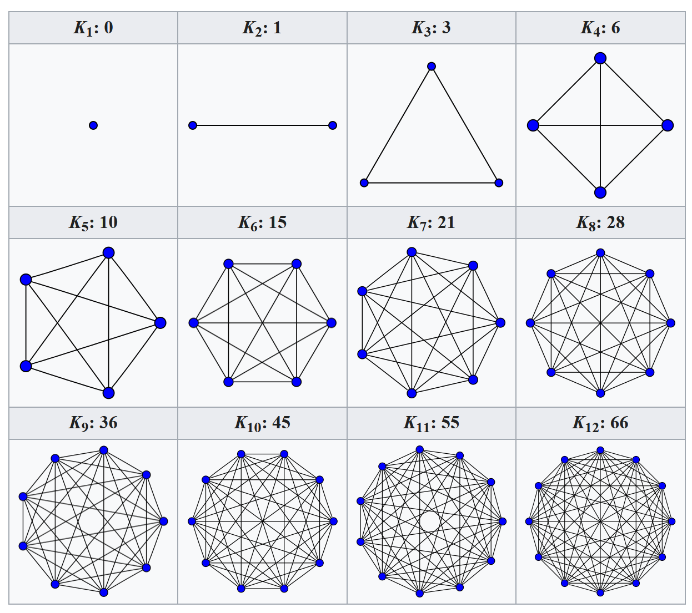
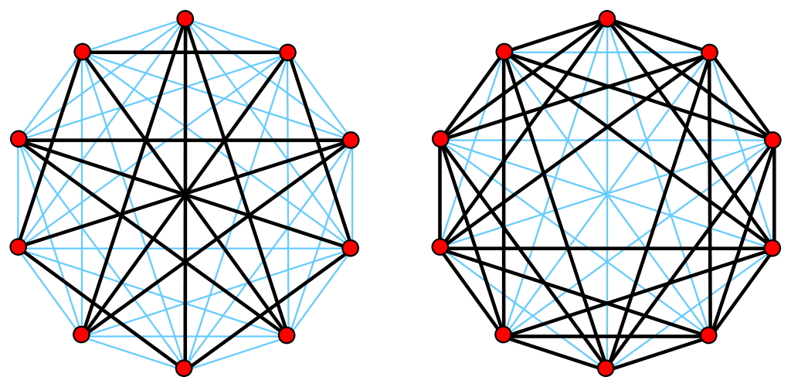
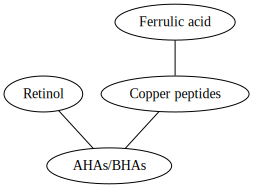
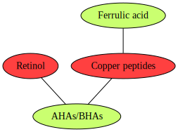

# Pigment

The problem of splitting up a skincare regime into partitions such that each
partition does not interfere with itself is equivalent to the
[minimal clique cover problem](https://en.wikipedia.org/wiki/Clique_cover),
which can be transformed into the
[vertex colouring of a graph](https://en.wikipedia.org/wiki/Graph_coloring#Vertex_coloring),
both of which are NP-hard and thus computationally infeasible to find optimal
solutions for. This project is a brute-force proof-of-concept that exhaustively
solves the problem of good skincare!

## Usage

1. Modify the ingredient conflict dictionary (named `conflict` in `pigment.py`)
   to reflect your skincare products. If you say `A` conflicts with `B`, you
   don't have to also write the rule that `B` conflicts with `A`. The script
   handles the reflexivity.

   In the code, this is done through a dictionary of strings named `conflicts`.
   Use the sample code to create your own list.

2. Run the program (you need Python 3):

   ```bash
   python3 pigment.py
   ```

## Algorithm

This algorithm takes in an adjacency list for a conflict graph where each edge
between two nodes represents an instance of two ingredients conflicting.

It then exhaustively generates every possible partition using a recursive
backtracking depth-first-search algorithm where for each ingredient, it
explores every sub-tree consisting of adding the ingredient to every existing
partition before finally creating a new partition. Each terminal/leaf node
represents a generated group of partitions, which we exhaustively check: for
each partition in the group, we check to see if any pair exists as an edge in
the conflict dictionary. If no such pairs exist among any partition, the group
is valid.



The algorithm looks for the valid group with the least amount of partitions.

The number of groups that are brute-force generated is equivalent to the
_n_<sup>th</sup> [Bell number](https://en.wikipedia.org/wiki/Bell_number) and
it is sequence [A000110](https://oeis.org/A000110) in the OEIS.

It runs in _O(a fuckton of time)_. If you have a lot of stuff in your skincare
routine, this algorithm may take forever to run.

You have been warned.

## Modelling

Say, for the purposes of illustration (as these opinions are still hotly
debated in the skincare community today), we have the following ingredients:

- Retinol
- AHAs/BHAs
- Copper peptides
- Ferrulic acid

and the following interactions:

- Retinol and AHAs/BHAs conflict with each other
- Copper peptides interfere with AHAs/BHAs
- Ferrulic acid interferes with copper peptides

We can therefore model compatible products as an undirected graph where each
node represents a skincare ingredient and each edge between node _a_ and node
_b_ represents the sentence "ingredient _a_ is compatible with ingredient _b_".
We can represent the relation above as such:



The ideal here is that we want to take all four of these ingredients at once,
however as noted by the conflicts above, that isn't possible. The next best
solution, if we can't create 1 group, is to try to create 2 groups. We know
that in our model, retinol is compatible with copper peptides, and ferrulic
acid is compatible with AHAs/BHAs, so we discard the possibility of using
retinol with ferrulic acid (as the group potentially containing ferrulic acid)
contains AHAs/BHAs, which are incompatible with retinol, as shown by the lack
of edge.



This is the optimal solution. In one skincare session, we take retinol with the
copper peptides, and another session we take AHAs/BHAs and ferrulic acid.

Our overarching goal, therefore, is to divide the ingredients list into as few
groups as possible such that each group's ingredients represents a clique,
where a clique is an induced subgraph that is complete. In layperson's terms,
we are looking to create subgraphs of ingredients such that each ingredient has
an edge connected to every other ingredient node in the subgraph. Such complete
subgraphs are known as cliques. As shown below, when two ingredients are
compatible with each other, the resultant clique has a single edge between two
nodes (as shown by _K<sub>2</sub>: 1_). For four ingredients, the resultant
clique has six edges between the four nodes (as shown by _K<sub>2</sub>:6_). To
see ten ingredients compatible with each other is somewhat uncommon.

| _K_<sub>1</sub>: 0                                                                 | _K_<sub>2</sub>: 1                                                                 | _K_<sub>3</sub>: 3                                                                 | _K_<sub>4</sub>: 6                                                                |
|------------------------------------------------------------------------------------|------------------------------------------------------------------------------------|------------------------------------------------------------------------------------|-----------------------------------------------------------------------------------|
|  |  |  |   |
| _K_<sub>5</sub>: 10                                                                | _K_<sub>6</sub>: 15                                                                | _K_<sub>7</sub>: 21                                                                | _K_<sub>8</sub>: 28                                                               |
|    |    |    |   |
| _K_<sub>9</sub>: 36                                                                | _K_<sub>10</sub>: 45                                                               | _K_<sub>11</sub>: 55                                                               | _K_<sub>12</sub>: 66                                                              |
|    |    |   |  |


_These images are taken from Wikipedia.org and are by koko90. See `LICENSE` for
details_

## Minimal Clique Cover

In formal terms, a "clique cover" or "partition into cliques" of an undirected
graph is a partition (or splitting of the graph into groups) into constituent
cliques. Our problem is to find the "**minimal**" clique cover—aka—doing it in
the least number of cliques—or splits—possible. As shown in the figure above,
the trivial case is _K<sub>1</sub>: 0_ as each individual ingredient is its own
clique, but that's the worst-case scenario we are trying to avoid. It would
mean that no skincare ingredient is compatible with anything else e.g. you
may have to take each 10 skincare ingredient on separate days, which would be a
scheduling nightmare.

## Graph Colouring

We can make things more readable by looking at an equivalent problem.

Given a graph _G_, the complement of the graph, let's call it _G2_, is a graph
with the same nodes as _G_, but every edge in the original graph is missing,
and every midding edge in the original graph is now an edge. In layperson's
terms, a complement graph _G2_ for graph _G_ contains only the edges necessary
to turn _G_ into a complete graph, as shown by this diagram:


_Image edited by Claudio Rocchini; derived from David Eppstein. See `LICENSE`
for details_

We can invert the "maximal clique" problem by not mapping whether two skincare
products are compatible with each other, but rather if they conflict. This
makes specifications a whole lot easier to make, as now we can assume anything
that isn't connected by an edge is compatible. If we change our first graph to
model conflicts instead of synergies, we get the following:



Our problem is now to induce subgraphs such that none of the nodes have any
edges between them. Each subgraph is its own group. In this example, we induce
the subgraphs for the nodes {`Retinol`, `Copper peptides`} as well as for
{`Ferrulic acid`, `AHAs/BHAs`}, as each graph has no nodes:



Those with a background in CS will immediately notice that this is actually the
well-studied graph colouring sub-problem known as "vertex colouring": colouring
a graph such that no two colours are adjacent to each other. In this case, each
colour group represents a partition, like from earlier. Again, the optimization
problem is NP-hard and is intractable. Which is why the algorithm solves the
colouring problem in the ugliest, most brute force way possible.

## Bibliography

- <https://en.wikipedia.org/wiki/Clique_cover>

- <https://en.wikipedia.org/wiki/Complement_graph>

- <https://en.wikipedia.org/wiki/Bell_number>

- <https://en.wikipedia.org/wiki/Graph_coloring>

## Other Attribution

Graphs made using <https://dreampuf.github.io/>

todo:
-bibliography
-license for photos
-add backpropagated tests to make sure everything in things exists as a key for conflicts
-instead of screenshot of table, put actual original links into table?